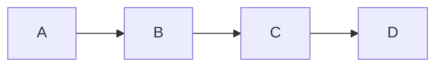
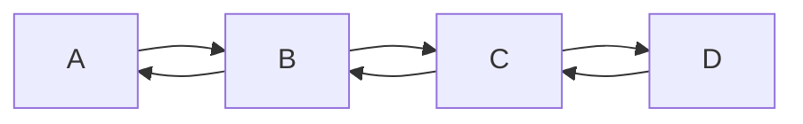
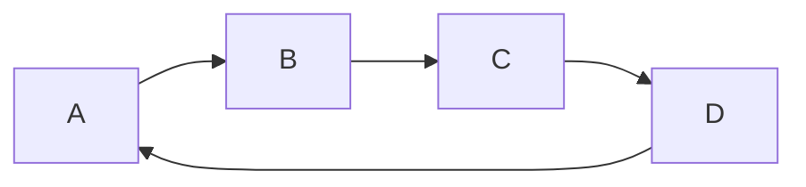
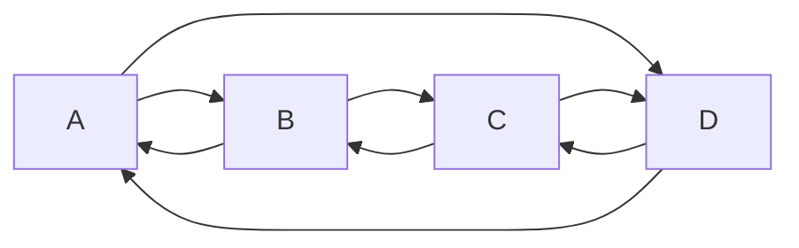

Linked lists are linear data structures in which elements are put in a sequence through the use of pointers/references.

The example above is a linked list, more specifically, a singly linked list, but we'll dive into the types of linked lists later. The main point of linked lists is that, even though it is more costly to retrieve data from a given node, the insert and delete operations are much quicker. This is due to the non-contiguous nature of storing the linked list's elements in memory, so it isn't needed to shift elements to the left when a new element is deleted, nor it's needed to shift elements to the right when a new element is added.

# Types of linked lists

There are five main types of linked lists, where each one preserve the main aspects presented above.

## Singly Linked List

The simplest way of building a linked list, where there's only one direction in which it's possible to navigate and there's nothing after the last element (null pointer/reference). When referring to linked lists, most of the times is this one.

## Doubly Linked List

In a doubly linked list, it's possible to navigate both ways from any given nodes besides for the first and the last one (as there's nothing before the first and nothing after the last).

## Circular Singly Linked List

Same as the singly linked list, but the last element will always have a reference to the first one, making it a cycle.

## Circular Doubly Linked List

Now it's actually possible to navigate both ways from any given node.

# Code examples

- [[Linked List in Java]]
- [[Doubly Linked List in Java]]

- [[Linked List in C++]]
- [[Doubly Linked List in C++]]
- 